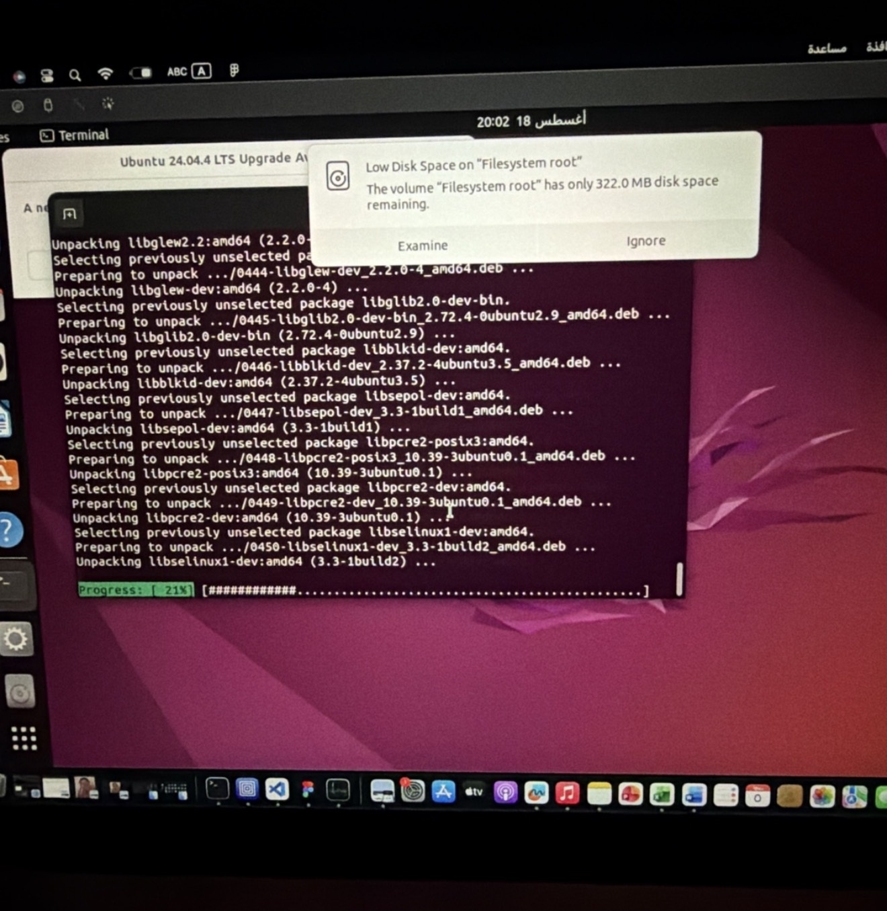

# ROS2

# ROS 2 Humble Installation Project

## Overview

This repository documents the installation and verification process of ROS 2 Humble on Ubuntu.

---

# Installation Steps

## 1. Install ROS 2 Humble

```bash
sudo apt install ros-humble-desktop
```

---

## 2. Configure ROS Environment

Add ROS environment to bash:

```bash
echo "source /opt/ros/humble/setup.bash" >> ~/.bashrc
```

Load the environment:

```bash
source ~/.bashrc
```

---

# Verification

## Check ROS Distribution

Command:

```bash
echo $ROS_DISTRO
```

Result:

```text
humble
```

---

## Check ROS System

Command:

```bash
ros2 doctor
```

Result:

```text
All 3 checks passed
```

---

# Evidence

ROS 2 Humble verification screenshot:



---

# Problems Encountered

## Low Disk Space Issue

During the installation process, a low disk space warning appeared.

The issue was solved by cleaning unused packages:

```bash
sudo apt clean
```

```bash
sudo apt autoremove -y
```

Fixing interrupted packages:

```bash
sudo dpkg --configure -a
```

Repairing broken dependencies:

```bash
sudo apt --fix-broken install
```

---

# Conclusion

ROS 2 Humble was successfully installed on Ubuntu.

The installation was verified using:

- `echo $ROS_DISTRO`
- `ros2 doctor`

The system passed all ROS checks and is ready to use.
