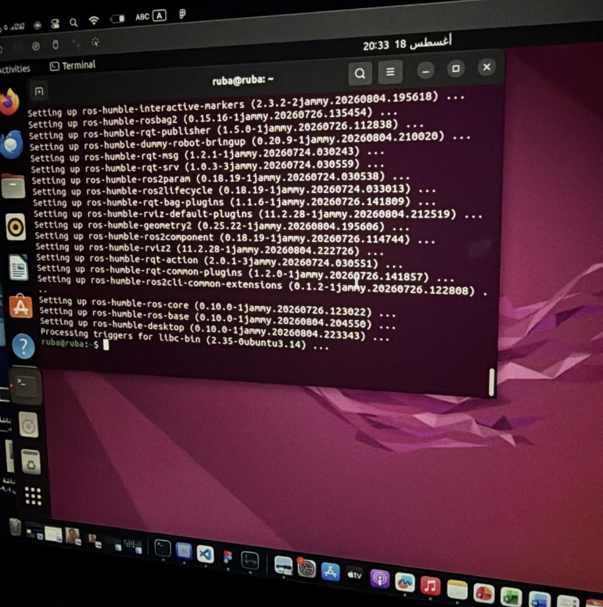
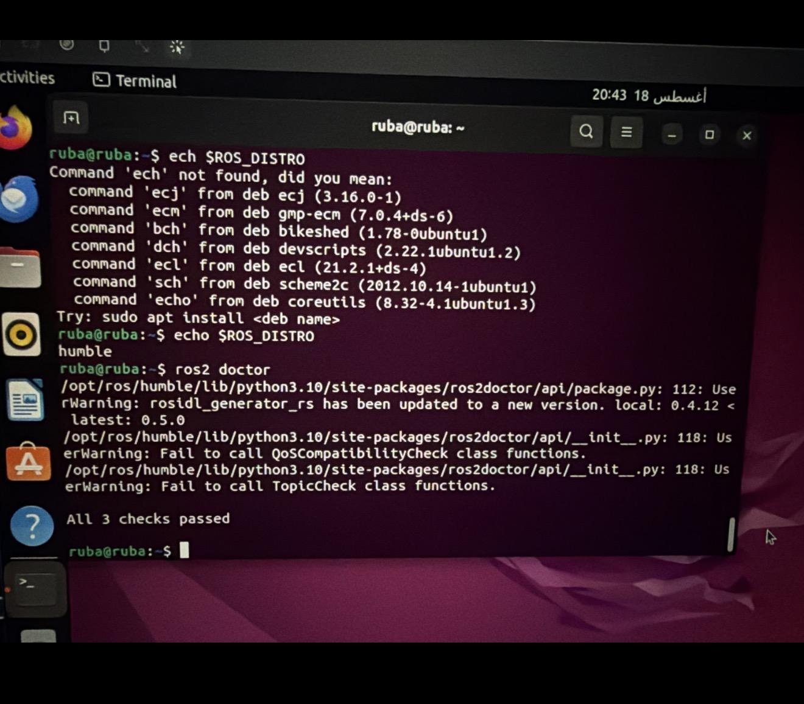

# ROS 2 Humble Installation Project

## Overview

This project demonstrates the installation and configuration of ROS 2 Humble on Ubuntu Linux.

The main objective of this task is to install the ROS 2 framework, configure the required environment, and verify that the installation is working correctly.

---

# 1. ROS 2 Humble Installation

ROS 2 Humble was installed successfully on Ubuntu Linux.

During the installation process, the required ROS 2 Humble packages were downloaded and configured.

The installation was completed successfully as shown below:



---

# 2. ROS 2 Environment Setup

After installing ROS 2 Humble, the environment was configured to load automatically when opening the terminal.

The following command was used:

```bash
echo "source /opt/ros/humble/setup.bash" >> ~/.bashrc
```

Then the environment was activated using:

```bash
source ~/.bashrc
```

---

# 3. Checking ROS 2 Distribution

The installed ROS 2 distribution was checked using:

```bash
echo $ROS_DISTRO
```

The output confirmed that the installed version is:

```bash
humble
```

---

# 4. ROS 2 Doctor Verification

The ROS 2 system was tested using the ROS 2 doctor command:

```bash
ros2 doctor
```

The verification process completed successfully and returned:

```bash
All 3 checks passed
```

This confirms that the ROS 2 Humble installation and configuration were successful.

The verification screenshot is shown below:



---

# 5. Commands Used

The main commands used during the setup process:

```bash
echo "source /opt/ros/humble/setup.bash" >> ~/.bashrc

source ~/.bashrc

echo $ROS_DISTRO

ros2 doctor
```

---

# Conclusion

ROS 2 Humble was successfully installed and configured on Ubuntu Linux.

The environment setup was completed, the ROS distribution was verified, and the ROS 2 doctor test confirmed that all checks passed successfully.
